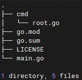
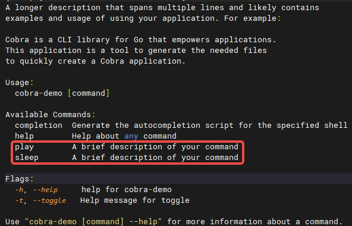

### cobra-cli安装

```shell
go install github.com/spf13/cobra-cli@latest
# go会自动安装到 $GOPATH/bin目录
```

### cobra-cli 代码生成

```shell
mkdir cobra-demo && cd cobra-demo
go mod init github.com/VictoryAnn/k8s-develop-skills/cobra-demo
cobra-cli init
# 自动生成rootCmd
```



```shell
cobra-cli add play -p 'rootCmd'
cobra-cli add sleep -p 'rootCmd'
# 子命令已添加到根命令rootCmd下
go build -o cobra-demo .
chmod +x cobra-demo
./cobra-demo -h
# 可以看到两条子命令已经添加好了

# 执行下面的命令测试
./cobra-demo play
# play called
./cobra-demo sleep
# sleep called
# 到这里cobra的框架已经搭好了
```



### cobra的参数传递

```go
# cmd/play.go
var game string
var playCmd = &cobra.Command{
	...
	Run: func(cmd *cobra.Command, args []string) {
		fmt.Println("play called")
		fmt.Println("u are playing", game)
	}
}
func init() {
	...
	playCmd.Flags().StringVarP(&game, "game", "g", "", "game kind like lol")
}
```

```shell
# 添加了flag之后重新编译运行
./cobra-demo play --game lol
# play called
# u are playing lol
```


